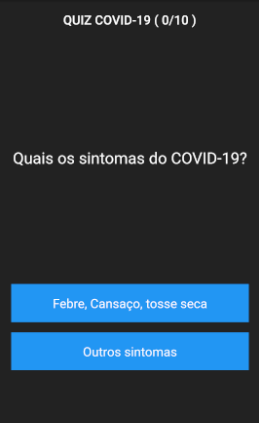

# App quiz sobre o COVID-19

App de perguntas sobre o Covid 19, criado para fins de estudo da linguagem Dart e do framework Flutter.

## Telas

O aplicativo utiliza uma api para obter as questões sobre o COVID-19, esta api fornece os dados via protocolo REST. Abaixo segue algumas imagens da tela.

  

OBS: Este aplicativo foi criado utilizando como referência o seguinte tutorial: